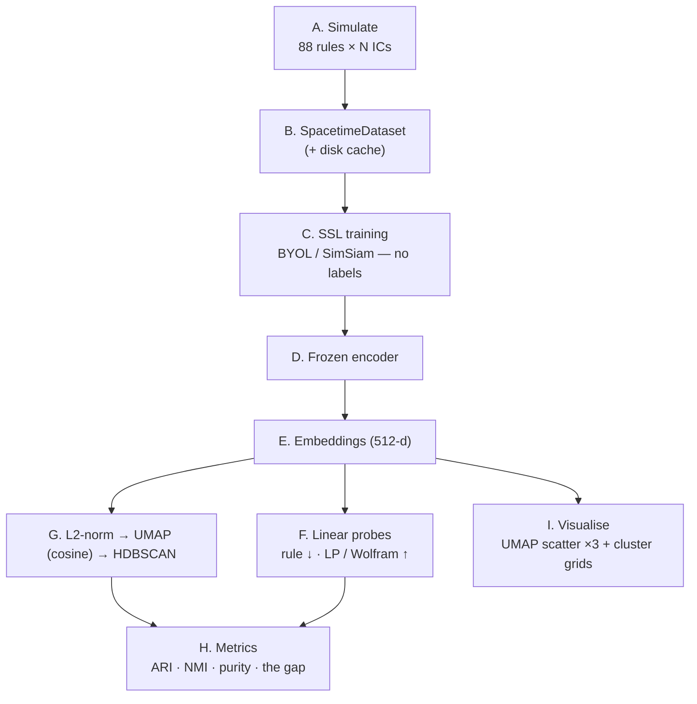

# Claude Design brief — Visual overview of the *caspectra* project

## What I want you to make

A single, **scrollable explanatory page / infographic** (think "annotated poster"
or a long landing-page) that lets me — and others — *understand the workflow at a
glance* and follow the **information flow** through the project. It must include:

1. a **big-picture pipeline diagram** (data → self-supervised learning → evaluation);
2. a **detailed flowchart of the self-supervised learning (SSL) loop itself**;
3. a **gallery of classification examples** (real cellular-automaton diagrams);
4. a compact **inventory of the machine-learning methods** used, shown as cards.

Audience: a technically literate scientist who is *not* an ML specialist. Goal is
intuition, not completeness. Prefer clarity and a clean visual rhythm over density.

### Output format
A responsive single page (sections stacked top-to-bottom). Diagrams should be
real vector/flow diagrams (boxes + arrows), not screenshots. Where I provide
node/edge lists or Mermaid, render them as proper diagrams.

### Visual direction
- **Aesthetic:** "cellular-automaton minimalism." The CA spacetime diagrams are
  literally black-and-white pixel grids — lean into that. Crisp monospace/pixel
  motifs, lots of whitespace, thin rules/grid lines.
- **Palette:** near-black ink `#111` on off-white `#FAFAF7`; one cool accent
  (e.g. teal `#0E7C86`) for the "phenotype / good" path and one warm accent
  (e.g. amber `#C8651B`) for the "genotype / cheat" path. Use accents sparingly.
- **Type:** a geometric sans for headings, a clean monospace for code/rule labels
  and the pixel diagrams.
- **Tone of copy:** plain, curious, precise. Short sentences. No hype.

---

## Section 1 — Hero

**Title:** *caspectra* — discovering the “behaviour” of cellular automata without labels

**One-line subtitle:** A self-supervised pipeline that groups cellular-automaton
spacetime diagrams by *what they do* (mesoscopic behaviour), not by *which rule*
generated them.

**The central idea, as a two-sided motif (this is the soul of the project):**
- **Genotype** (warm accent) = the local update rule (an 8-bit table). Reading it
  off the image is *cheating*.
- **Phenotype** (cool accent) = the emergent, mesoscopic pattern. This is what we
  want the model to learn.
- Tagline under the motif: *“Learn the phenotype, suppress the genotype.”*

**Visual:** a single spacetime diagram on the left morphing (arrow) into two
things on the right — a tiny “rule table” (genotype, warm) crossed out, and a
soft/blurred mesoscopic pattern (phenotype, cool) highlighted.

---

## Section 2 — What is a cellular automaton? (ground the reader)

Short explainer copy:
> An **elementary cellular automaton (ECA)** is a row of binary cells. At each
> time step every cell updates from itself and its two neighbours using a fixed
> 8-entry rule (one of 256 rules). Stacking the rows downward in time gives a
> **spacetime diagram** — a black-and-white image. We treat that image as data.
> Different rules produce wildly different *behaviours*; the 256 rules collapse to
> **88 equivalence classes** under mirror/colour symmetry.

**Visual:** a small 3-cell neighbourhood → 1 output-cell diagram (the “T-tetromino”
motif), then an arrow to a full spacetime diagram. Caption: *time increases
downward; boundaries wrap (periodic).*

---

## Section 3 — Classification examples (the gallery)

Render each example as a **clean black-and-white pixel grid** (filled square = 1,
empty = 0). The ASCII below is the *real, correct* data from the simulator —
reproduce it faithfully as crisp pixels, labelled with the rule number and class.
Lay them out as a responsive gallery of cards (≈4 across on desktop).

These five span the **Li–Packard behavioural classes** (the reference taxonomy):

**Rule 0 — Null** *(everything dies to blank)* — equivalence class {0, 255}
```
█████░█░███░░██░░█░░█░░█░░██░█░█░░░░██░░
░░░░░░░░░░░░░░░░░░░░░░░░░░░░░░░░░░░░░░░░
░░░░░░░░░░░░░░░░░░░░░░░░░░░░░░░░░░░░░░░░
░░░░░░░░░░░░░░░░░░░░░░░░░░░░░░░░░░░░░░░░
░░░░░░░░░░░░░░░░░░░░░░░░░░░░░░░░░░░░░░░░
```

**Rule 232 — Fixed point** *(majority vote; settles into static blocks)*
```
█████░█░███░░██░░█░░█░░█░░██░█░█░░░░██░░
██████░████░░██░░░░░░░░░░░███░█░░░░░██░░
███████████░░██░░░░░░░░░░░████░░░░░░██░░
███████████░░██░░░░░░░░░░░████░░░░░░██░░
███████████░░██░░░░░░░░░░░████░░░░░░██░░
```

**Rule 178 — Periodic** *(stable repeating texture)*
```
█████░█░███░░██░░█░░█░░█░░██░█░█░░░░██░░
░███░█░█░█░██░░██░██░██░██░░█░█░█░░█░░██
█░█░█░█░█░█░░██░░█░░█░░█░░██░█░█░██░██░░
░█░█░█░█░█░██░░██░██░██░██░░█░█░█░░█░░██
█░█░█░█░█░█░░██░░█░░█░░█░░██░█░█░██░██░░
```

**Rule 154 — Locally chaotic** *(chaos confined within domain walls)*
```
█████░█░███░░██░░█░░█░░█░░██░█░█░░░░██░░
████░░░░██░███░██░██░██░███░░░░░█░░██░██
███░█░░██░░██░░█░░█░░█░░██░█░░░█░███░░██
██░░░███░███░██░██░██░███░░░█░█░░██░████
█░█░███░░██░░█░░█░░█░░██░█░█░░░███░░████
```

**Rule 30 — Chaotic** *(random-looking; used in PRNGs)* — class {30, 86, 135, 149}
```
█████░█░███░░██░░█░░█░░█░░██░█░█░░░░██░░
█░░░░░█░█░░███░████████████░░█░██░░██░██
░█░░░██░████░░░█░░░░░░░░░░░███░█░███░░█░
███░██░░█░░░█░███░░░░░░░░░██░░░█░█░░████
░░░░█░████░██░█░░█░░░░░░░██░█░██░████░░░
```

And the **iconic “complex” case** that motivates the whole field (Wolfram class IV
— neither ordered nor chaotic; supports moving “glider” structures):

**Rule 110 — Complex** *(gliders + collisions; Turing-complete)* — class {110, 124, 137, 193}
```
█████░█░███░░██░░█░░█░░█░░██░█░█░░░░██░░
█░░░█████░█░███░██░██░██░███████░░░███░█
█░░██░░░█████░████████████░░░░░█░░██░███
█░███░░██░░░███░░░░░░░░░░█░░░░██░█████░░
███░█░███░░██░█░░░░░░░░░██░░░█████░░░█░█
░░█████░█░█████░░░░░░░░███░░██░░░█░░████
░██░░░█████░░░█░░░░░░░██░█░███░░██░██░░█
```

**Rule 90 — Sierpiński** *(from a single seed; self-similar fractal)* — class {90, 165}
```
░░░░░░░░░░░░░░░░░░░█░░░░░░░░░░░░░░░░░░░
░░░░░░░░░░░░░░░░░░█░█░░░░░░░░░░░░░░░░░░
░░░░░░░░░░░░░░░░░█░░░█░░░░░░░░░░░░░░░░░
░░░░░░░░░░░░░░░░█░█░█░█░░░░░░░░░░░░░░░░
░░░░░░░░░░░░░░░█░░░░░░░█░░░░░░░░░░░░░░░
░░░░░░░░░░░░░░█░█░░░░░█░█░░░░░░░░░░░░░░
░░░░░░░░░░░░░█░░░█░░░█░░░█░░░░░░░░░░░░░
```

> Caption for the gallery: *The same kind of black-and-white image, five (or six)
> radically different behaviours. A human sorts these instantly by texture; the
> challenge is teaching a model to do the same — without it secretly reading the
> rule.*

---

## Section 4 — The tension: behaviour vs. rule (why this is hard)

Copy:
> Here is the trap. A spacetime diagram almost always contains **every one of the
> 8 rule-table entries** in plain sight (each is a 3-cell neighbourhood and the
> cell it produces — a little “T-tetromino”). So a powerful model can score
> ~99% on classification simply by **reconstructing the rule and looking up its
> class** — learning nothing about behaviour. That is the *failure mode*.
> Success is measured as a **gap**: the model should identify *behaviour* well
> while identifying the *exact rule* poorly.

**Visual:** a two-lane diagram.
- *Warm lane (the cheat):* diagram → detect T-tetrominoes → reconstruct 8-bit rule
  → lookup class. Mark with a “✗ shortcut.”
- *Cool lane (the goal):* diagram → see mesoscopic texture → behaviour. Mark “✓.”
- A small gauge motif: “rule accuracy ↓ low” vs “class accuracy ↑ high” = **the gap**.

---

## Section 5 — The big-picture pipeline (information flow)

Render this as a clean **left-to-right (or top-to-bottom) flow** with grouped
stages. Node/edge list:

- **A. Simulate** — `ECASimulator`: 88 representative rules × N random initial
  conditions → spacetime diagrams (cached to disk).
- **B. Dataset** — `SpacetimeDataset`: serves images (1×128×128, values in [0,1])
  with metadata `{rule, equiv_class_rep}`.
- **C. Self-supervised training** — BYOL (default) or SimSiam → learns an encoder
  with **no labels**.
- **D. Frozen encoder** — training done; weights frozen.
- **E. Embeddings** — each diagram → a 512-d vector (the encoder’s pre-projector
  output).
- **F. Linear probes** — fit logistic regressions: embedding → rule (want **low**),
  embedding → LP class / Wolfram class (want **high**).
- **G. Clustering** — L2-normalise → **UMAP** (cosine) → **HDBSCAN**; cluster count
  emerges; outliers = noise.
- **H. Metrics & diagnostics** — ARI / NMI / purity vs reference classes; the
  rule-vs-class **gap**.
- **I. Visualise** — 2-D UMAP scatter (coloured 3 ways: rule, LP class, cluster) +
  grids of each cluster’s most representative diagrams.

Mermaid (render as a diagram; the cool accent should follow the C→D→E→{F,G,I} path):


---

## Section 6 — The SSL loop, in detail (the centrepiece flowchart)

This is the most important diagram. Render it large and carefully. It shows how
the model learns *without labels* by making two augmented “views” of the same
diagram agree.

Explainer copy (sidebar):
> One diagram is augmented **twice** into two views. An *online* network tries to
> predict the *target* network’s representation of the other view. The target is a
> slow-moving (EMA) copy of the online network, with a **stop-gradient** so the
> model can’t cheat by collapsing. The augmentations decide what the model treats
> as irrelevant — here, **spatial phase** (cyclic shift) and **fine pixel detail**
> (coarse-graining). Coarse-graining is the key move: it destroys the rule-level
> detail while keeping the mesoscopic structure.

Node/edge list for the flowchart:
- `x` (one spacetime diagram) → **TwoViewTransform**.
- TwoViewTransform → **view 1** and **view 2** (each = random cyclic-shift +
  2×2 coarse-grain).
- view 1 → **Online encoder** f_θ → **Projection head** g_θ → **Predictor** q_θ → `p`.
- view 2 → **Target encoder** f_ξ → **Target projection** g_ξ → `z` (stop-gradient).
- `p` and `z` → **negative cosine similarity loss** (computed symmetrically, i.e.
  also with the views swapped).
- Loss → **backprop** updates the *online* path only.
- Online weights → **EMA update (τ → 1)** → target weights (dashed arrow).
- Separately: Online encoder → **`extract_embedding` (512-d, pre-projector)** →
  used for all evaluation (links to Section 5, node E).

Annotate the two “knobs”:
- **Encoder** = ResNet-18 (1-channel) *or* a small custom CNN; GroupNorm by default.
- **Heads** = projection 512 → 4096 → 256, predictor 256 → 4096 → 256.

Mermaid:
```mermaid
flowchart LR
  X["Spacetime diagram x"] --> TV{{TwoViewTransform<br/>shift + coarse-grain}}
  TV -->|view 1| OE["Online encoder fθ"]
  TV -->|view 2| TE["Target encoder fξ"]
  OE --> OP["Projection gθ<br/>512→4096→256"]
  OP --> QP["Predictor qθ<br/>256→4096→256"]
  TE --> TP["Target projection gξ"]
  QP --> L((["Negative cosine loss<br/>(symmetrised)"]))
  TP -->|stop-gradient| L
  L -.->|backprop · online only| OE
  OE ==>|"EMA  τ→1"| TE
  OP ==>|"EMA  τ→1"| TP
  OE -->|"extract_embedding (512-d)"| EMB[("Embeddings → evaluation")]
```

> Footnote: **SimSiam** is the small-batch fallback — same picture but with *no*
> target network: both views share one encoder and the stop-gradient alone
> prevents collapse.

---

## Section 7 — ML methods inventory (cards)

Render as a tidy grid of small cards, each with an icon, a name, and one line of
“what it does here.”

- **BYOL** — self-supervised learning via an online/target pair + EMA; the default
  trainer. *Learns features with no labels.*
- **SimSiam** — negative-free SSL with stop-gradient; the small-batch fallback.
- **ResNet-18 (1-channel)** — the main image encoder. *Maps a diagram to 512 numbers.*
- **Small custom CNN** — a lightweight encoder alternative (fewer params,
  less prone to memorising the rule).
- **GroupNorm** — normalisation that stays stable at small batch sizes (chosen for
  Apple-Silicon memory limits).
- **EMA momentum** — slow exponential averaging that builds the stable “target.”
- **Data augmentation** — *cyclic shift* (exact symmetry; ignore spatial phase) and
  *coarse-graining* (blur away rule-level detail). The scientific heart of the method.
- **UMAP** — non-linear dimensionality reduction (cosine metric) for clustering and
  for the 2-D map.
- **HDBSCAN** — density-based clustering; the number of clusters *emerges* rather
  than being chosen.
- **Logistic-regression probes** — simple linear read-outs that measure how much
  *rule* vs *behaviour* information the embedding holds (the gap).

---

## Section 8 — What “good” looks like (close the loop)

Copy + a simple two-bar / gauge visual:
> A successful run keeps the **rule probe low** (the model did *not* just learn the
> rule) while keeping **behaviour-class agreement high** — a large *gap*. As a
> reference, the earlier *supervised* model reached ≈98% on behaviour class while
> falling to ≈61% on exact-rule identity. The self-supervised version aims for a
> similar separation **without ever seeing a label** — and, ideally, reveals
> behavioural structure the human reference taxonomies miss (especially around the
> elusive “complex / class IV” rules).

**Visual:** two bars — “behaviour-class agreement” (cool, tall) vs “exact-rule
identification” (warm, short) — with a bracket labelled **“the gap = success.”**

---

## Notes for rendering the pixel diagrams
- Treat `█` as a filled (ink) cell and `░` as an empty (paper) cell. Render as a
  uniform square grid with thin or no gridlines; keep aspect ratio square per cell.
- The top row of each block is the random initial condition; each row below is one
  time step. Keep them small (thumbnail-sized) in the gallery, enlarge on hover if
  interactive.
- Do not “prettify” the patterns — their exact structure is the point.
```
Legend:  █ = live cell (1)      ░ = dead cell (0)      time flows downward
```
